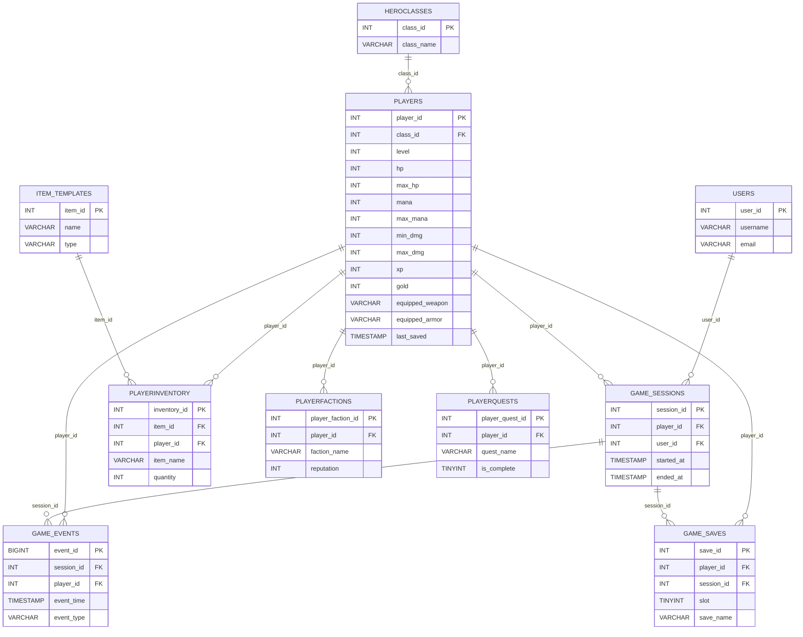
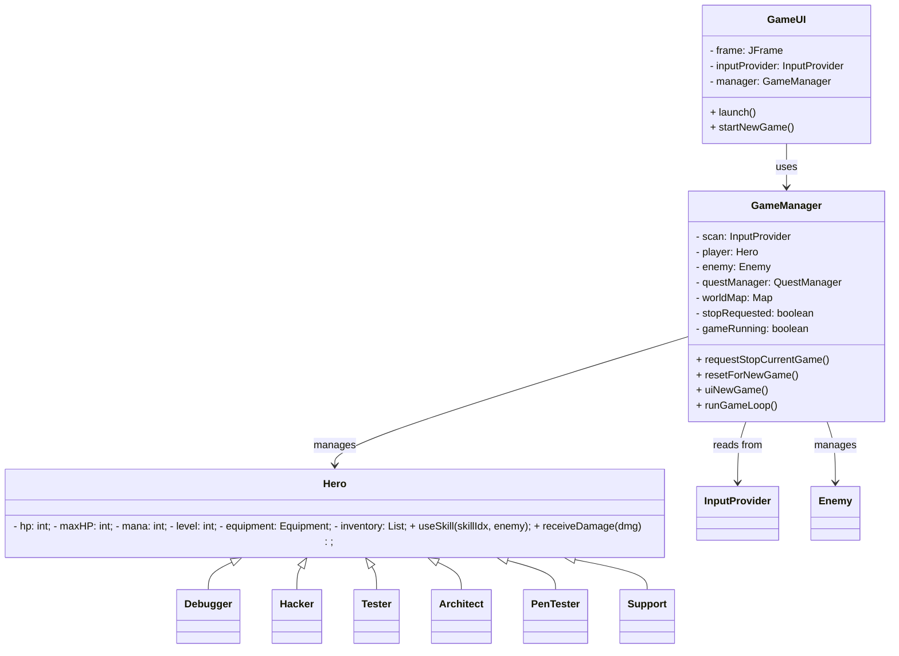
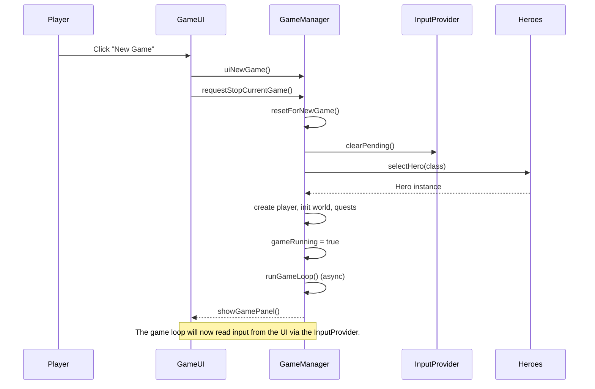
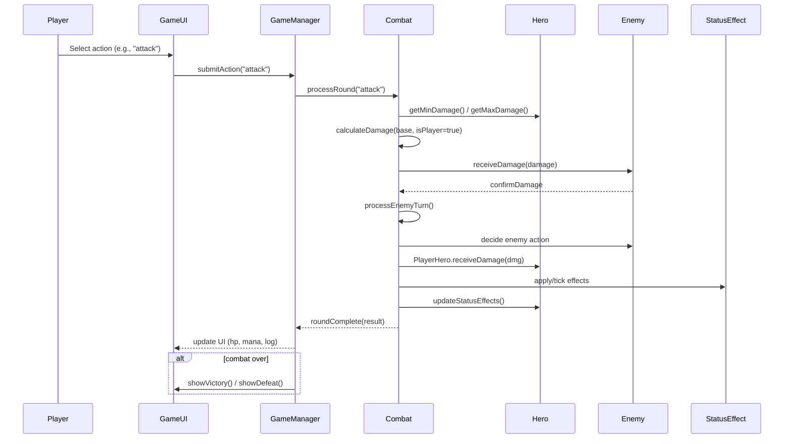

# Programmed Escapist

Software Development Document


An Object-Oriented Programming Project Presented to the Faculty of the
College of Computer Studies
University of the Immaculate Conception
Father Selga St., Davao City, Philippines


## Software Purpose

Project: "Programmed Escapist"

Purpose:
Programmed Escapist is an educational turn-based RPG designed to teach programming concepts and cybersecurity principles through an engaging gameplay experience. The game immerses players in a digital world where they take on the role of a programmer-hero battling against various software threats and malware. By exploring locations, completing quests, and engaging in combat, players learn about programming paradigms, security vulnerabilities, and problem-solving in a fun, interactive way.

Key Value:
- For instructors: A playful environment for teaching security/programming concepts.
- For learners: Interactive practice with concepts (debugging, exploits, testing, patching) embedded into mechanics.
- For engagement: Replay content with classes, faction quests, and item progression.


## Objectives, Features, and Modules

### 2.1 Core Objectives
- Build a turn-based combat engine illustrating OOP patterns.
- Implement multiple hero classes with unique skills and cooldowns.
- Implement enemy tiers and special abilities.
- Provide quest and faction mechanics for variety and progression.
- Provide simple persistent-friendly classes for future save/load.

### 2.2 Game Features

#### Character System
- **Hero Classes**
  - Debugger: Tank class with high HP and defensive abilities
    - Debug: Analyze enemy weaknesses
    - Patch: Heal self and reduce damage taken
    - Inspect: Reveal enemy information and stats
  - Hacker: DPS class focused on exploits and system manipulation
    - Exploit: High damage attack with cooldown
    - DDOS: Area effect damage over time
    - Rootkit: Plant hidden damage amplifier
  - Tester: Strategic class with analysis and verification abilities
    - Scan: Detect enemy vulnerabilities
    - Verify: Validate defenses and boost resistance
    - Penetration Test: High precision attack
  - Architect: Support/Tank hybrid with structural abilities
    - Design: Create defensive structures
    - Rally: Team-wide defense boost
    - Unyielding Spirit: Emergency survival ability
  - PenTester: Stealth class with infiltration abilities
    - Probe: Analyze defenses
    - Breach: Bypass enemy defenses
    - Stealth: Temporary invisibility
  - Support: Pure support class with team enhancement abilities
    - Patch: Heal allies
    - Buffer: Temporary stat boost
    - System Restore: Group heal

#### Combat System
- **Turn-Based Combat Engine**
  - Initiative-based turn order
  - Action point system
  - Cooldown management
  - Status effect tracking
  - Combat log with detailed info
- **Status Effects**
  - Buffs: Enhance character stats
  - Debuffs: Weaken enemies
  - DoT (Damage over Time) effects
  - HoT (Healing over Time) effects
  - Stat modifiers (Attack, Defense, Speed)
- **Enemy System**
  - Multiple enemy tiers (Weak, Normal, Strong)
  - Special abilities per enemy type
  - Dynamic difficulty scaling
  - Boss encounters
  - Enemy AI patterns

#### Progression Systems
- **Equipment System**
  - Weapons with unique stats
  - Armor with protection values
  - Special effect items
  - Consumable items
  - Equipment restrictions per class
- **Inventory Management**
  - Weight-based inventory system
  - Item categories
  - Equipment slots
  - Quick-use slots
  - Storage system
- **Quest System**
  - Main story quests
  - Side quests
  - Daily quests
  - Achievement-based quests
  - Quest chains
- **Faction System**
  - Multiple factions to join
  - Reputation tracking
  - Faction-specific quests
  - Faction rewards
  - Inter-faction relationships

#### Game World
- **Locations**
  - Multiple zones with unique themes
  - Different difficulty levels per area
  - Environmental effects
  - Safe zones (towns)
  - Combat areas
- **NPCs**
  - Quest givers
  - Merchants
  - Trainers
  - Faction representatives
  - Story characters

#### Technical Features
- **Save/Load System**
  - Multiple save slots
  - Auto-save feature
  - Save file management
  - Progress tracking
  - Character persistence
- **User Interface**
  - Character portrait system
  - Animated sprites
  - Status bars and indicators
  - Combat interface
  - Inventory management UI
  - Quest log
  - Map interface
- **Game Settings**
  - Difficulty settings
  - UI customization
  - Control options
  - Sound settings
  - Performance options

#### Educational Elements
- **Programming Concepts**
  - Object-Oriented design through class system
  - Debugging through game mechanics
  - Testing methodology in combat
  - System architecture in abilities
  - Security concepts in PenTester skills
- **Skill Development**
  - Strategic thinking
  - Resource management
  - Problem-solving
  - Risk assessment
  - Team coordination

### 2.3 Technical Implementation

#### Core Systems
- **Game Engine** (`GameManager.java`)
  - Main game loop
  - State management
  - Event handling
  - Resource management
  - Game flow control

- **Combat Engine** (`Combat.java`)
  - Turn management
  - Action resolution
  - Damage calculation
  - Status effect processing
  - Combat state tracking

- **UI System** (`GameUI.java`)
  - Swing-based interface
  - Component management
  - Event handling
  - Animation system
  - Resource loading

#### Data Management
- **Save System**
  - Serialization
  - State persistence
  - Progress tracking
  - Character data
  - Game settings

- **Resource Management**
  - Sprite loading
  - Asset caching
  - Memory management
  - Resource cleanup
  - Error handling

#### Class Architecture
- **Base Classes**
  - `Hero.java`: Abstract base for all player classes
  - `Enemy.java`: Enemy entity implementation
  - `Quest.java`: Quest system implementation
  - `Location.java`: World location management
  - `Faction.java`: Faction system implementation

- **Support Classes**
  - `StatusEffect.java`: Effect management
  - `Equipment.java`: Item system
  - `CharacterSprite.java`: Sprite handling
  - `ConsoleOutputInterceptor.java`: Output management
  - `InputProvider.java`: Input handling

#### System Requirements
- Java Runtime Environment (JRE) 21 or later
- Minimum 2GB RAM
- 500MB disk space
- Graphics support for Swing UI
- Keyboard and mouse input

#### Development Tools
- Java Development Kit (JDK) 21
- NetBeans IDE (recommended)
- Git for version control
- Ant build system

### 2.3 Recent Improvements and Changes

#### UI Enhancements
- Fixed sprite visibility issues for all character classes
- Implemented unique character sprites for each class:
  - Debugger: White mage themed sprite (defensive specialist)
  - Hacker: Dark robed character (offensive specialist)
  - PenTester: Rogue-like character (stealth specialist)
  - Architect: Knight themed character (structural specialist)
  - Tester: Archer themed character (precision specialist)
  - Support: Healer themed character (team specialist)
- Centered character sprites in portrait panel with proper margins
- Removed doubled HP/mana bars for cleaner UI
- Improved sprite animation handling and state management
- Added proper error reporting for sprite loading failures

#### Code Structure Improvements
- Enhanced sprite path resolution system
- Added fallback paths for resource loading
- Improved error handling and logging
- Added detailed debug information for troubleshooting
- Implemented proper cleanup of sprite resources
- Enhanced component lifecycle management

#### Documentation Updates
- Added comprehensive test cases in `TEST_CASES.md`
- Created detailed database ER diagrams (PlantUML and Mermaid versions)
- Added class diagrams showing system architecture
- Added sequence diagrams for game flow and combat
- Enhanced README with technical documentation
- Added API documentation for key classes

#### Game Mechanics
- Improved character class balancing
- Enhanced sprite state management (idle, moving, combat)
- Added proper resource cleanup
- Improved error handling and user feedback
- Enhanced component lifecycle management

#### Future Planned Improvements
- Add additional character customization options
- Implement more varied enemy sprites
- Add particle effects for combat actions
- Enhance animation system with more states
- Add sound effects and background music
- Implement achievement system
- Add tutorial system for new players
- Console UI with optional ANSI colors (Color.java)
- Simple map/location system (Location.java)


### 2.3 System Modules (OOP Structure)

- `TurnBased_RPG` (Main entry)
  - `GameManager` (High-level game control, menus, travel, encounter)
- `Hero` (abstract base class)
  - `Debugger`, `Hacker`, `Tester`, `Architect`, `PenTester`, `Support` (subclasses)
- `Enemy` (enemy model)
- `Combat` (combat logic)
- `Quest`, `QuestManager` (quests and reward handling)
- `Faction` (faction mechanics)
- `Location` (world nodes and environmental effects)
- `StatusEffect` (buff/debuff framework)
- `Color` (console coloring utility)


## Technology Used

Core Technologies:
- GUI Framework: Java Swing
- Database: MySQL & phpMyAdmin (schema provided)
- Programming Language: Java (JDK 17 recommended)
- Packaging: Plain Java sources (project currently uses package `progescps`)
- Serialization: Java Serializable interfaces used for some classes (Quest, Faction, Hero internals)

Development Tools:
- IDE: VS Code and Apache NetBeans
- Version Control: Git / GitHub
- Testing: VS Code Terminal
- Documentation: This README file


## User Manual

### 4.1 Installation & Startup
1. Install a Java 17 JDK (Temurin/Adoptium recommended): https://adoptium.net/
2. Verify installation in a terminal (zsh):

```bash
java -version
javac -version
```

Expected: Java 17.x reported.

### 4.2 First-Time Setup
- Splash Screen: displayed before the main menu.
- Main Menu Page: start/load/quit options.
- Choose your character page: select one of the hero classes.
- Main Game UI: the primary UI where gameplay occurs (combat, quests, inventory).


## Technical Manual

### 5.1 Development Environment Setup

Prerequisites Verification:

```bash
# Check Java installation
java -version
# Expected output: java version "17.0.5" 2022-10-18 LTS

# Check Maven installation
mvn --version
# Expected output: Apache Maven 3.8.6
```

Note for macOS (zsh): run the above commands in Terminal. If the commands report a different Java/Maven version, ensure your PATH and JAVA_HOME are set to the JDK 17 installation (Temurin/Adoptium recommended). Example (zsh):

```bash
# Temporarily set JAVA_HOME to Temurin 17 (adjust path as needed)
export JAVA_HOME=$(/usr/libexec/java_home -v 17)
export PATH="$JAVA_HOME/bin:$PATH"
java -version
```

### 5.2 Database Schema

This project includes a MySQL schema for saving game sessions, saves, players, inventories, quests, factions, and templates. A full SQL dump (created with phpMyAdmin) is included in the project materials. Key tables include:
- `players`, `heroclasses`, `game_saves`, `game_sessions`, `playerinventory`, `playerquests`, `playerfactions`, `item_templates`.

See the provided SQL dump in project attachments for the full schema and sample data.

### 5.3 Project Setup Instructions

1. Option 1 — Compile and run from source (simple):

```bash
# from project root (zsh)
javac -d build/classes $(find src -name "*.java")
java -cp build/classes progescps.TurnBased_RPG
```

2. Option 2 — Import into an IDE (NetBeans/VSCode/IntelliJ):
- Open the project folder in your IDE.
- Set the project JDK to Java 17.
- Build and run `progescps.TurnBased_RPG` as the main class.

3. (Optional) Convert to Maven layout if desired. Create `pom.xml`, move sources into `src/main/java`, then run `mvn clean compile`.


## Project Development Phases (example roadmap)

- Week 1-2: Requirements & UML design
- Week 3-4: Database and persistence layer
- Week 5-7: Core gameplay classes (Hero/Enemy/Combat)
- Week 8-10: UI (Swing) and quest/faction systems
- Week 11-12: Integration and testing
- Week 13: Documentation and final polishing


## Limitations and Future Development

### 7.1 Current Limitations

- Single-user only — no concurrent users
- Local storage only — no cloud sync
- Basic reporting & export features missing
- No automatic backups

### 7.2 Future Development Plan

Short-term enhancements:
- [ ] Multi-user & role-based support
- [ ] Export (PDF/CSV) and backup/restore
- [ ] Input validation & improved UX

Long-term roadmap:
- [ ] Web-based version (Spring Boot)
- [ ] Mobile companion app
- [ ] Cloud synchronization
- [ ] Advanced analytics and charts

Technical debt:
- [ ] Add dependency injection for testability
- [ ] Introduce logging (SLF4J/logback)
- [ ] Refactor persistence to an ORM (Hibernate)


## Appendix

- UML diagrams, sequence diagrams and ERD should be added here by the team.
- Include test cases and sample execution logs.

### Database Relationship Diagram

The project includes a database relationship diagram in two formats:

- PlantUML source: `diagrams/database_er.puml` (useful if you run PlantUML locally)
- Mermaid source (GitHub-renderable): `diagrams/database_er.mmd`

Embedded below is the Mermaid ER diagram which GitHub should render inline. If your viewer doesn't render Mermaid, open `diagrams/database_er.mmd` or use a Mermaid live editor.



Render instructions (PlantUML -> PNG):

```bash
# Requires PlantUML and Graphviz installed on your machine
plantuml -tpng diagrams/database_er.puml
# Output: diagrams/database_er.png
```

If you want, I can commit a pre-rendered PNG/SVG for you — I can't run PlantUML in this environment, but I can add the generated file if you provide it, or I can generate a static SVG approximation. Tell me which you prefer.

## Design Diagrams

I added UML diagrams (PlantUML sources) to `diagrams/`:

- `diagrams/class_diagram.puml` — simplified class diagram for core classes and relationships.
- `diagrams/sequence_newgame.puml` — sequence diagram for the "Start New Game" flow (UI -> Manager -> loop).
- `diagrams/sequence_combat_round.puml` — sequence diagram for a single combat round (player action -> Combat -> Enemy).

Mermaid versions (GitHub-renderable) are also included:

- `diagrams/class_diagram.mmd` — Mermaid class diagram
- `diagrams/sequence_newgame.mmd` — Mermaid sequence: New Game
- `diagrams/sequence_combat_round.mmd` — Mermaid sequence: Combat Round

Embedded Mermaid class and sequence diagrams (GitHub will render these inline):

### Class Diagram (Mermaid)



### Sequence: Start New Game (Mermaid)



### Sequence: Combat Round (Mermaid)



You can render each PlantUML file locally (requires PlantUML & Graphviz):

```bash
plantuml -tpng diagrams/class_diagram.puml
plantuml -tpng diagrams/sequence_newgame.puml
plantuml -tpng diagrams/sequence_combat_round.puml
```

This will create PNG images (`diagrams/*.png`) next to the sources.


## Comments / Grading (template)

Provide scoring and instructor feedback here in submission.


## Formatting Instructions for Word Document

1. Page Setup:
   - Margins: 1 inch all sides
   - Font: Times New Roman, 12pt
   - Line spacing: Single
   - Page numbers: Bottom center

2. Headings:
   - Main Title: 16pt, Bold, Centered
   - Section Headers: 14pt, Bold
   - Sub-sections: 12pt, Bold

3. Special Formatting:
   - Code blocks: Consolas font, 10pt, gray background
   - Tables: Grid format, centered
   - Checkboxes: Use Wingdings symbols (☐ ☑)

4. File Naming:
   - Save as: `TeamName_ProjectName_Submission.docx`


---

If you'd like, I can also:
- generate a Word (`.docx`) version of this document following the formatting instructions,
- add the SQL dump into a separate file under `database/` in the repo,
- or convert these instructions into a project `CONTRIBUTING.md` and `INSTALL.md`.

Let me know which of those you'd prefer next.
# bnew-draft